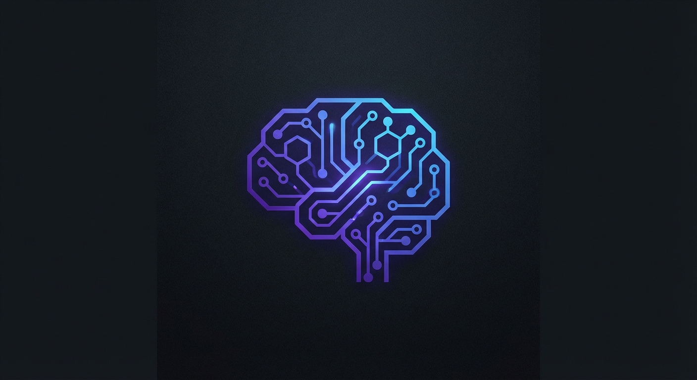

<p align="center">
  
</p>

# Membrain

**Neuromorphic Memory Bridge for LLM Agents**

A Spiking Neural Network (SNN) based memory system that provides associative recall and continuous learning for AI agents — like a synthetic hippocampus.

[](https://www.python.org)
[](LICENSE)
[](https://github.com/tfatykhov/membrain)

## Why Membrain?

Traditional RAG (Retrieval Augmented Generation) uses vector databases for static retrieval. Membrain is different:

| Feature | Vector DB (RAG) | Membrain (SNN) |
|---------|-----------------|----------------|
| **Retrieval** | Static similarity search | Dynamic associative recall |
| **Learning** | Requires reindexing | Continuous, plastic updates |
| **Associations** | None (just nearest neighbors) | Forms semantic links between concepts |
| **Energy** | O(n) comparisons | O(active neurons) — sparse |
| **Pattern Completion** | No | Yes — recalls from partial/noisy input |

## Architecture


## Key Concepts

### FlyHash Encoding
Converts dense LLM embeddings (1536-d floats) into sparse binary spike trains (20,000-d binary) using random projection + Winner-Take-All inhibition. This enables efficient SNN processing.

### Associative Memory
Uses Nengo's neural populations with Voja learning rule to form dynamic associations. Unlike hash tables, memories naturally cluster by semantic similarity.

### Pattern Completion
Query with noisy or partial input → network settles into learned attractor state → returns complete memory. Works with up to 20% noise.

## Installation

```bash
# Clone the repository
git clone https://github.com/tfatykhov/membrain.git
cd membrain

# Create virtual environment
python -m venv .venv
source .venv/bin/activate  # or `.venv\Scripts\activate` on Windows

# Install dependencies
pip install -e ".[dev]"
```

## Quick Start

### Start the Memory Service

```bash
# Using Docker (recommended)
docker compose up -d

# Or run directly
python -m membrain.server
```

### Connect from Your Agent

```python
import grpc
from membrain.proto import memory_a2a_pb2, memory_a2a_pb2_grpc

# Connect to Membrain
channel = grpc.insecure_channel('localhost:50051')
memory = memory_a2a_pb2_grpc.MemoryUnitStub(channel)

# Store a memory
response = memory.Remember(memory_a2a_pb2.MemoryPacket(
    context_id="doc-001",
    vector=embedding,  # Your 1536-d embedding
    importance=0.8
))

# Recall associated memories
result = memory.Recall(memory_a2a_pb2.QueryPacket(
    vector=query_embedding,
    threshold=0.7
))
print(f"Recalled: {result.context_ids}")
```

## API Reference

### gRPC Methods

| Method | Description |
|--------|-------------|
| `Remember(MemoryPacket)` | Store a context vector with learning |
| `Recall(QueryPacket)` | Retrieve associated context IDs |
| `Consolidate(SleepSignal)` | Trigger memory consolidation phase |

### Message Types

```protobuf
message MemoryPacket {
  string context_id = 1;      // UUID of the text chunk
  repeated float vector = 2;  // Dense embedding (1536-d)
  float importance = 3;       // 0.0-1.0, modulates learning rate
}

message QueryPacket {
  repeated float vector = 1;  // Query embedding
  float threshold = 2;        // Similarity threshold
}

message ContextResponse {
  repeated string context_ids = 1;
  float confidence = 2;
}
```

## Development

```bash
# Run tests
pytest tests/ -v

# Run linting
ruff check src/

# Run type checking
mypy src/

# Format code
ruff format src/
```

## Project Structure

```
membrain/
├── src/
│   └── membrain/
│       ├── __init__.py
│       ├── server.py         # gRPC server
│       ├── encoder.py        # FlyHash implementation
│       ├── core.py           # Nengo SNN network
│       └── proto/            # Generated gRPC stubs
├── tests/
│   ├── test_flyhash.py
│   ├── test_memory.py
│   └── test_integration.py
├── docker/
│   └── Dockerfile
├── protos/
│   └── memory_a2a.proto
├── pyproject.toml
└── README.md
```

## Success Metrics (PoC)

| Metric | Target | Description |
|--------|--------|-------------|
| **SynOp Count** | Linear scaling | Operations scale with active neurons, not total |
| **Sparsity** | >90% | Less than 10% of neurons fire per timestep |
| **Pattern Completion** | 100% @ 20% noise | Full retrieval with noisy queries |

## Roadmap

- [x] PRD and architecture design
- [x] Project scaffolding and CI/CD
- [x] FlyHash encoder implementation
- [x] Nengo SNN core (BiCameralMemory)
- [x] Learning gate for read-only recall
- [ ] gRPC server (Feature 01)
- [ ] Docker containerization
- [ ] Integration tests
- [ ] Lava process integration (Feature 04)
- [ ] Loihi hardware migration path

## References

- [Intel Loihi 2](https://www.intel.com/content/www/us/en/research/neuromorphic-computing.html)
- [Nengo Documentation](https://www.nengo.ai/)
- [Lava Framework](https://github.com/lava-nc/lava)
- [FlyHash Paper](https://arxiv.org/abs/1711.03127) — Sparse binary codes for neural systems
- [Voja Learning Rule](https://www.nengo.ai/nengo/examples/learning/learn_associations.html)

## License

MIT License — see [LICENSE](LICENSE) for details.

---

*Membrain: Because your AI deserves a hippocampus.*
