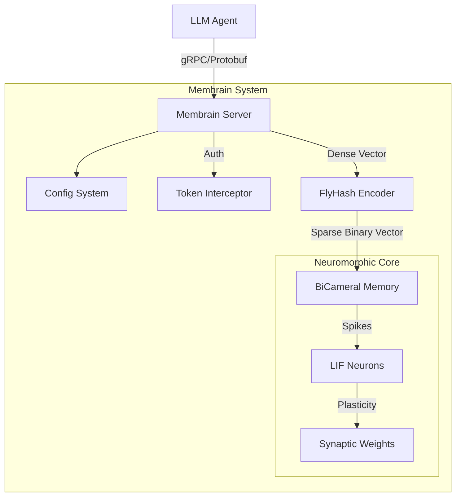

# System Architecture

## Overview

Membrain is a neuromorphic memory system for LLM agents, exposing a gRPC interface. It uses a biological-inspired approach to store and retrieve high-dimensional embeddings.

The system consists of three main layers:

1.  **Interface Layer (gRPC Server)**: Handles A2A (Agent-to-Agent) communication, authentication, and request validation.
2.  **Encoder Layer (FlyHash)**: Projects dense embeddings into sparse, high-dimensional binary vectors suitable for SNNs.
3.  **Core Layer (Neuromorphic Memory)**: Uses a Spiking Neural Network (SNN) to store patterns via synaptic plasticity.

## Component Diagram

## Module Description

### 1. Configuration (`membrain.config`)
Centralized configuration management using `MembrainConfig` dataclass.
- Loads settings from environment variables.
- Validates parameters at startup.
- Supports deterministic execution via seeds.
- Provides fast presets for testing (`for_testing()`).

### 2. Server (`membrain.server`)
Implements the `MemoryUnit` gRPC service.
- **Protocol**: Defined in `protos/memory_a2a.proto`.
- **Auth**: Bearer token authentication with constant-time comparison.
- **Lifecycle**: Graceful shutdown handling.

### 3. Encoder (`membrain.encoder`)
Implements the FlyHash algorithm (inspired by the fruit fly olfactory system).
- Expands input dimensionality (e.g., 1536 -> 20,000+).
- Enforces sparsity via Winner-Take-All (WTA) inhibition.
- Preserves locality-sensitive hashing properties.

### 4. Core (`membrain.core`)
The SNN storage engine.
- **Neurons**: Leaky Integrate-and-Fire (LIF) model.
- **Learning**: Hebbian-style plasticity or structural plasticity (depending on implementation phase).
- **Consolidation**: Sleep phase processing to strengthen strong memories and prune weak ones.
