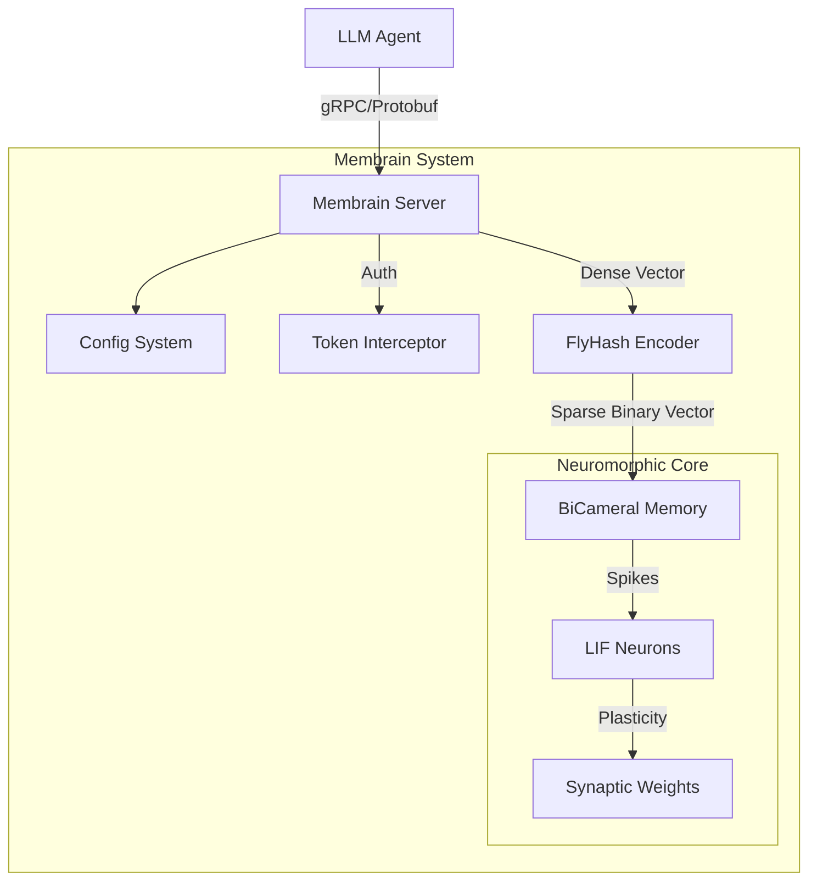

# System Architecture

## Overview

Membrain is a neuromorphic memory system for LLM agents, exposing a gRPC interface. It uses a biological-inspired approach to store and retrieve high-dimensional embeddings.

The system consists of three main layers:

1.  **Interface Layer (gRPC Server)**: Handles A2A (Agent-to-Agent) communication, authentication, and request validation.
2.  **Encoder Layer (FlyHash)**: Projects dense embeddings into sparse, high-dimensional binary vectors suitable for SNNs.
3.  **Core Layer (Neuromorphic Memory)**: Uses a Spiking Neural Network (SNN) to store patterns via synaptic plasticity.

## Component Diagram

## Module Description

### 1. Configuration (`membrain.config`)
Centralized configuration management using `MembrainConfig` dataclass.
- Loads settings from environment variables.
- Validates parameters at startup.
- Supports deterministic execution via seeds.
- Provides fast presets for testing (`for_testing()`).

### 2. Server (`membrain.server`)
Implements the `MemoryUnit` gRPC service.
- **Protocol**: Defined in `protos/memory_a2a.proto`.
- **Auth**: Bearer token authentication with constant-time comparison.
- **Lifecycle**: Graceful shutdown handling.

### 3. Encoder (`membrain.encoder`)
Implements the FlyHash algorithm (inspired by the fruit fly olfactory system).
- Expands input dimensionality (e.g., 1536 -> 20,000+).
- Enforces sparsity via Winner-Take-All (WTA) inhibition.
- Preserves locality-sensitive hashing properties.

### 4. Core (`membrain.core`)
The SNN storage engine.
- **Neurons**: Leaky Integrate-and-Fire (LIF) model.
- **Learning**: Hebbian-style plasticity or structural plasticity (depending on implementation phase).
- **Consolidation**: Sleep phase processing to strengthen strong memories and prune weak ones.
# Membrain Implementation Documentation

## Overview

Membrain is a neuromorphic memory system designed to provide associative memory capabilities to LLM agents. Unlike traditional vector databases which rely on dense vector similarity search (k-NN), Membrain uses Spiking Neural Networks (SNNs) and sparse distributed representations to store and retrieve information.

This approach mimics biological memory systems (specifically the hippocampus and fruit fly olfactory system) to offer:
- **Online Learning:** Memories are learned incrementally via synaptic plasticity (Voja rule).
- **Pattern Completion:** Retrieval is a dynamic process of settling into attractor states.
- **Consolidation:** Offline "sleep" phases strengthen important memories and prune weak ones.
- **Efficiency:** Sparse binary codes reduce computational cost and noise.

## System Architecture

The system consists of three main layers:

1.  **Transport Layer (gRPC Server):**
    - Handles Agent-to-Agent (A2A) communication.
    - Manages authentication, request validation, and concurrency.
    - Exposes a high-level API: `Remember`, `Recall`, `Consolidate`.

2.  **Encoding Layer (FlyHash):**
    - Converts dense LLM embeddings (e.g., OpenAI Ada-002, 1536-d) into high-dimensional sparse binary codes.
    - Inspired by the *Drosophila* (fruit fly) olfactory circuit.
    - Preserves locality: similar dense vectors map to similar sparse codes (overlapping active bits).

3.  **Neuromorphic Core (BiCameralMemory):**
    - A Nengo-based Spiking Neural Network.
    - **Learning:** Maps sparse inputs to internal neuron representations using the **Voja** (Vector Oja) learning rule.
    - **Recall:** Uses the network's dynamics to "complete" noisy or partial queries into full stored patterns.
    - **Consolidation:** Runs without input to stabilize weights and optimize storage.

## Data Flow

### 1. Remember (Storage)
1.  **Input:** Client sends a dense embedding vector (e.g., from a text chunk) + `context_id`.
2.  **Encode:** `FlyHash` projects the dense vector to a sparse binary vector (e.g., 20,000-d with 50 active bits).
3.  **Learn:** `BiCameralMemory` injects the sparse vector into the SNN. The Voja learning rule adjusts synaptic weights to associate the pattern with a specific population of neurons.
4.  **Index:** The sparse vector is also stored in a fast lookup index (Python dictionary) for final confidence scoring.

### 2. Recall (Retrieval)
1.  **Input:** Client sends a query dense vector.
2.  **Encode:** `FlyHash` converts the query to a sparse binary vector.
3.  **Converge:** The SNN receives the query. Neural dynamics settle into an "attractor" state—the network's best guess of the original stored memory.
4.  **Match:** The resulting state is compared against the stored index using cosine similarity.
5.  **Output:** Returns `context_ids` that match above a confidence threshold.

### 3. Consolidate (Maintenance)
1.  **Sleep:** The system enters a sleep mode (no external input).
2.  **Settle:** The network runs freely, allowing weights to stabilize.
3.  **Prune:** (Optional) Memories with low importance scores are removed to free up capacity.

## Directory Structure

- `src/membrain/core.py`: **BiCameralMemory** (SNN implementation).
- `src/membrain/encoder.py`: **FlyHash** (Sparse encoder).
- `src/membrain/server.py`: **gRPC Server** (Service entry point).
- `protos/memory_a2a.proto`: **Protocol Definitions** (API contract).

## Dependencies

- **Nengo:** For spiking neural network simulation.
- **NumPy:** For vector operations and math.
- **gRPC / Protobuf:** For the server interface.
