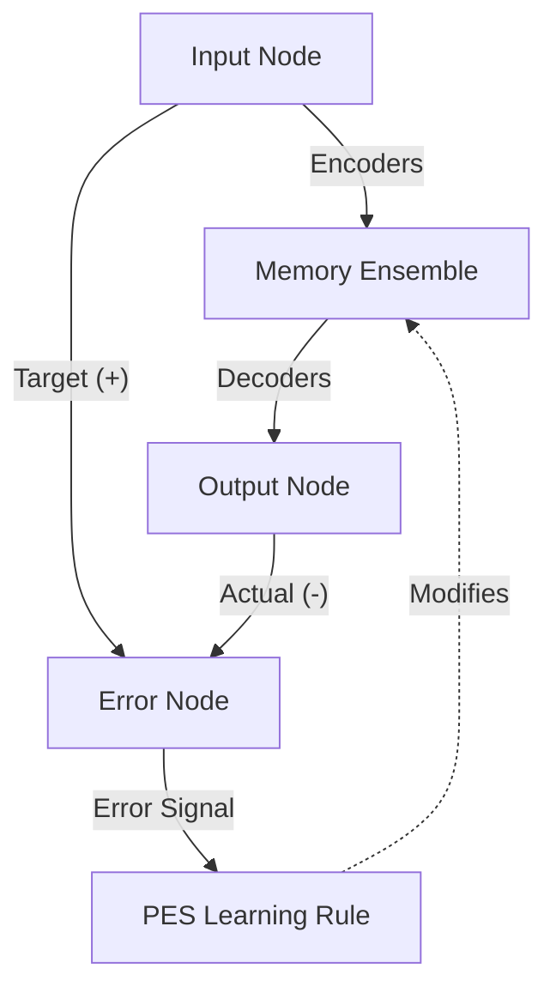

# Feature 16: PES Decoder Adaptation

**Status:** ✅ Complete
**Priority:** P1 - High
**Target File:** `src/membrain/core.py`
**Depends On:** Feature 03 (Neuromorphic Core)
**Merged:** PR #41

---

## Objective

Enhance the accuracy of memory reconstruction by implementing the **Prescribed Error Sensitivity (PES)** learning rule on the decoder weights. While the Voja rule (Feature 03) adapts the encoders to cluster neurons around input patterns, PES adapts the decoders to minimize the difference between the represented value and the actual input.

This combination allows the system to not only form distinct representations (Voja) but also accurately reconstruct the original high-dimensional vectors (PES).

---

## Architecture



---

## Core Concepts

### PES Learning Rule
The Prescribed Error Sensitivity (PES) rule is an error-driven learning rule that modifies synaptic weights to minimize a specified error signal. In this architecture:
- **Target**: The original sparse input vector.
- **Actual**: The decoded output from the memory ensemble.
- **Error**: `Input - Output`.

### Gated Learning
Learning should only occur during the **Remember** phase. During **Recall**, the weights must be static to prevent the query (which might be partial or noisy) from overwriting the stored memory.
- **Remember Phase**: Learning enabled (PES active).
- **Recall Phase**: Learning disabled (PES inactive).

---

## Implementation Details

### Error Computation
An auxiliary `nengo.Node` is used to compute the error signal dynamically during the simulation.

```python
# Error = Input - Output
error_node = nengo.Node(size_in=dimensions)
nengo.Connection(input_node, error_node, transform=1)
nengo.Connection(output_node, error_node, transform=-1)
```

### Learning Connection
The connection from the memory ensemble to the output node is equipped with the PES rule, modulated by the computed error.

```python
# Connection with PES learning
conn = nengo.Connection(
    memory.neurons,
    output_node,
    transform=np.zeros((dimensions, n_neurons)), # Start with zero weights
    learning_rule_type=nengo.PES(learning_rate=pes_learning_rate)
)

# Pipe error to the learning rule
nengo.Connection(error_node, conn.learning_rule)
```

### Learning Gate
To disable learning during recall, we effectively set the learning rate to zero or disconnect the error signal. In the Nengo simulation, this is often handled by controlling the `learning_rate` or the error signal magnitude via a gain node.

---

## Configuration

New environment variables control this feature:

| Variable | Default | Description |
|----------|---------|-------------|
| `MEMBRAIN_USE_PES` | `true` | Enable PES learning on decoders. |
| `MEMBRAIN_PES_LEARNING_RATE` | `1e-4` | Learning rate for error correction. |

---

## Impact

- **Accuracy**: Significantly reduces reconstruction error (RMSE) for stored vectors.
- **Stability**: Helps the attractor dynamics settle into the correct state by ensuring the "readout" is accurate.
- **Overhead**: Adds minimal computational cost (one extra vector subtraction per timestep).
